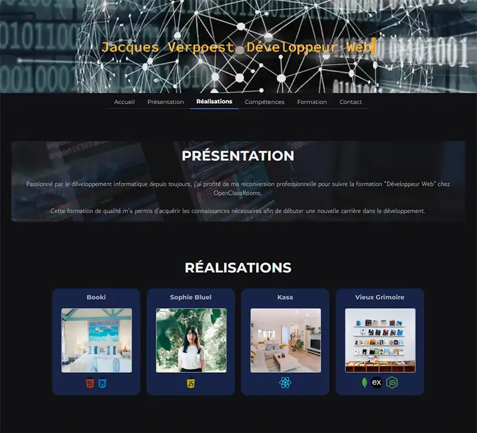

# Mon Portfolio

Bienvenue dans le code source de mon portfolio ! Ce projet est construit avec [Vite](https://vitejs.dev/) et [React](https://reactjs.org/). Il a pour but de présenter mes compétences, mes projets, et de me servir de vitrine professionnelle en ligne.

## Table des matières

- [Aperçu](#aperçu)
- [Fonctionnalités](#fonctionnalités)
- [Installation](#installation)
- [Scripts disponibles](#scripts-disponibles)
- [Technologies utilisées](#technologies-utilisées)
- [Améliorations futures](#améliorations-futures)
- [A propos](#a-propos)

## Aperçu



## Fonctionnalités

- Page d’accueil interactive
- Sections pour les réalisations, les compétences, et les informations de contact
- Transitions et animations pour une expérience utilisateur agréable
- Conception réactive et adaptée aux mobiles

## Installation

1. **Cloner le projet** :
   ```bash
   git clone https://github.com/jackvpt/portfolio.git
   cd portfolio

2. **Installer les dépendances** :
   ```bash
   npm install

3. **Lancer le projet en local** :
   ```bash
   npm run dev

2. **Ouvrir le navigateur** :
   http://localhost:5173/


## Scripts disponibles

- npm run dev : Lance l'application en mode développement
- npm run build : Crée une version de production optimisée du portfolio
- npm run preview : Prévisualise la version de production du portfolio

## Technologies utilisées

- Vite - Pour un bundling rapide et léger
- React - Pour construire l'interface utilisateur
- Sass - Pour le style et les animations

## Améliorations futures
- Ajout d'un mode clair
- Ajout d'une version en Anglais

## A propos
Ce portfolio est développé et maintenu par Jacques Verpoest. N'hésitez pas à me contacter si vous avez des questions ou des opportunités de collaboration !

Merci d'avoir pris le temps de consulter mon code ! 😊